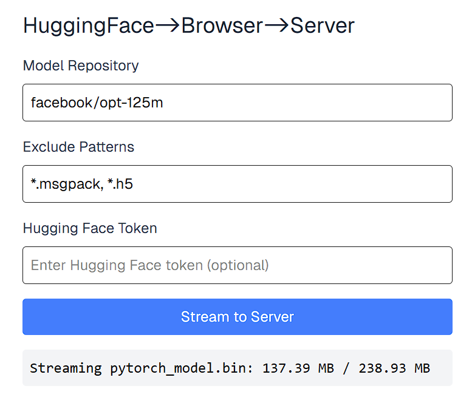

# huggingface2airgap
This repo serves as an example for:
use the browser as a proxy to download HuggingFace models to an air gapped server

## Setups
### React Frontend
```bash
cd ./frontend
npm install
npm run build
```
Now you should get the export html files at `./frontend/out`. The Python backend will mount it.

### FastAPI Backend
```bash
cd ./backend
pip install -r requirements.txt
uvicorn main:app --host 0.0.0.0 --port 8000
```
or, with `uv`
```bash
cd ./backend
uv sync
uv run uvicorn main:app --host 0.0.0.0 --port 8000
```

## Demo




```bash
# tree ~/.cache/huggingface/hub
/path/to/home/.cache/huggingface/hub
└── models--facebook--opt-125m
    ├── refs
    │   └── main
    └── snapshots
        └── 27dcfa74d334bc871f3234de431e71c6eeba5dd6
            ├── LICENSE.md
            ├── README.md
            ├── config.json
            ├── generation_config.json
            ├── merges.txt
            ├── pytorch_model.bin
            ├── special_tokens_map.json
            ├── tokenizer_config.json
            └── vocab.json

4 directories, 10 files
```
Note that, the files are stored under `snapshots` folder directly, instead of soft-link to a file the `blob` folder as in the `huggingface-cli`.